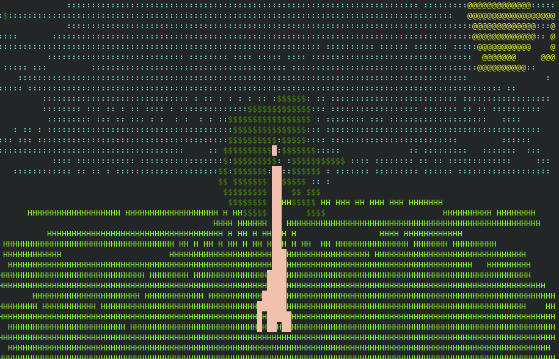
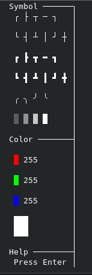
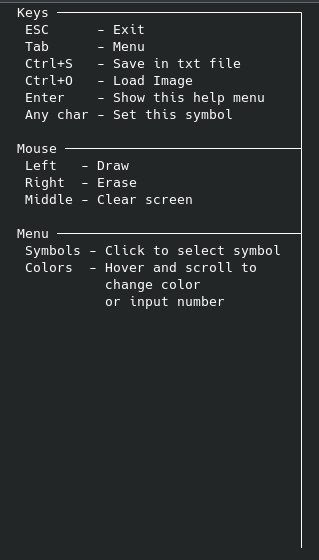
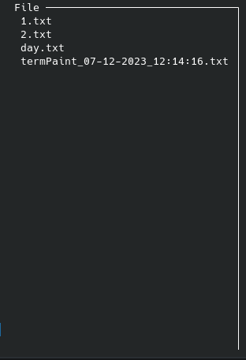

# termPaint
Drawing in the terminal

## Features
- Drawing by cursor
- Choosing any symbol from the keyboard
- Choosing the color of RGB
- Save image
- Load image

## Examples




## Menus

      


## Requirements
```agsl
go 1.20
```

## Installation

### Docker
```bash
docker run -ti artemiy88/termpaint
```

### Go

```bash
go install github.com/14Artemiy88/termPaint@latest
```
Make sure the Go executables directory ($GOPATH/bin) is added to your PATH environment variable. You can achieve this using the following command:
```bash
export PATH=$PATH:$(go env GOPATH)/bin
```
#### Usage
```bash
termPaint
```

### Snap
```bash
sudo snap install --beta termpaint
```
#### Usage
```bash
termpaint
```