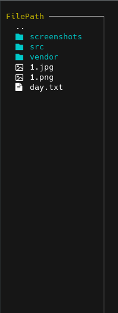

# termPaint
Drawing in the terminal

## Features
- Drawing by cursor
- Choosing any symbol from the keyboard
- Choosing the color of RGB
- Save image
- Load image

## Examples


## Usage
use `--help` key for more information
```bash
Drawing in the terminal

KEYS
      ESC, Ctrl+C         Exit
      Tab, F2             Menu
      Ctrl+S              Save in txt file
      Ctrl+O, F3          Load Image
      Ctrl-H, F1          Help menu
      Any char            Set as a Symbol
      F3                  SHape menu

MOUSE
      Left                Draw
      Right               Erase
      Middle              Clear Screen
```

## Menus

      


## Requirements
```agsl
go 1.20
```

## Installation

<details>
  <summary><b>Docker</b></summary>

```bash
docker run -ti artemiy88/termpaint
```
</details>

<details>
  <summary><b>Go</b></summary>

```bash
go install github.com/14Artemiy88/termPaint@latest
```
Make sure the Go executables directory ($GOPATH/bin) is added to your PATH environment variable. You can achieve this using the following command:
```bash
export PATH=$PATH:$(go env GOPATH)/bin
```
#### Usage
```bash
termPaint
```
</details>

<details>
  <summary><b>Snap</b></summary>

```bash
sudo snap install --beta termpaint
```
#### Usage
```bash
termpaint
```
</details>


