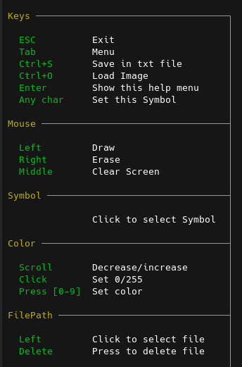

# termPaint
Drawing in the terminal

## Features
- Drawing by cursor
- Choosing any symbol from the keyboard
- Choosing the color of RGB
- Save image
- Load image

## Examples


## Menus

      


## Requirements
```agsl
go 1.20
```

## Installation
```bash
go build
```

[//]: # (## Installation)
[//]: # (Make sure the Go executables directory &#40;$GOPATH/bin&#41; is added to your PATH environment variable. You can achieve this using the following command:)
[//]: # (```bash)
[//]: # (export PATH=$PATH:$&#40;go env GOPATH&#41;/bin)
[//]: # (```)
[//]: # (and then)
[//]: # (```bash)
[//]: # (go install github.com/14Artemiy88/termPaint@latest)
[//]: # (```)
[//]: # ()
[//]: # (## Usage)
[//]: # (```bash)
[//]: # (termPaint)
[//]: # (```)